# Hybrid GraphRAG for Agent Zero
## Comprehensive Technical Documentation

---

# Table of Contents
1. [Executive Summary](#executive-summary)
2. [Architecture Overview](#architecture-overview)
3. [Core Components](#core-components)
4. [SPEP Protocol](#spep-protocol)
5. [Advanced Brain Protocols](#advanced-brain-protocols-2026)
6. [Hybrid Retrieval Process](#hybrid-retrieval-process)
7. [Entity Types & Relationships](#entity-types--relationships)
8. [Integration Points](#integration-points)
9. [Configuration Guide](#configuration-guide)
10. [Benefits & Use Cases](#benefits--use-cases)
11. [Comparison with Default Memory](#comparison-with-default-memory)

---

# Executive Summary

**Hybrid GraphRAG for Agent Zero** is an intelligence-boosting extension that **augments** traditional "flat" document retrieval with a **Structured Knowledge Layer**. It integrates a **Neo4j Knowledge Graph** directly into the Agent Zero memory loop **while preserving native memory behavior**.

## Key Innovation

| Traditional RAG | Hybrid GraphRAG |
|----------------|-----------------|
| Finds text snippets based on similarity | Understands entities and relationships |
| Single-hop retrieval | Multi-hop reasoning |
| Pattern matching | Context-aware reasoning |
| Isolated facts | Connected knowledge |

---

# Architecture Overview

## System Architecture Diagram

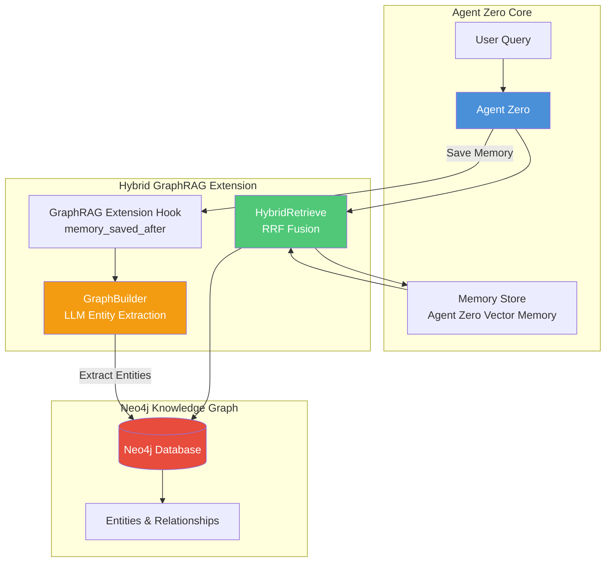

## Data Flow Architecture

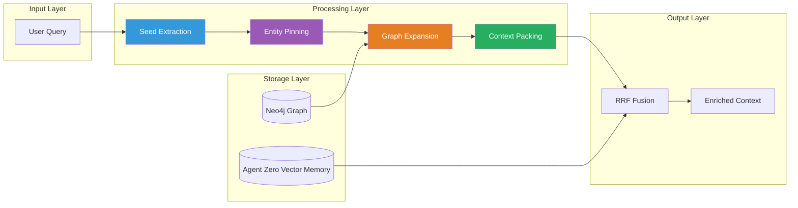

---

# Core Components

## 1. Neo4jConnector

**Purpose**: Asynchronous client handling Neo4j connections and queries.

```python
# Location: /a0/src/neo4j_connector.py
# Key Features:
# - Async connection pooling
# - Safe Cypher execution
# - Graceful error handling
# - Connection health monitoring
```

### Connection Parameters
| Parameter | Default | Description |
|-----------|---------|-------------|
| NEO4J_URI | bolt://localhost:7687 | Neo4j connection URI |
| NEO4J_USER | neo4j | Database user |
| NEO4J_PASSWORD | - | Database password |

## 2. GraphBuilder

**Purpose**: LLM-driven entity extraction and relationship building.

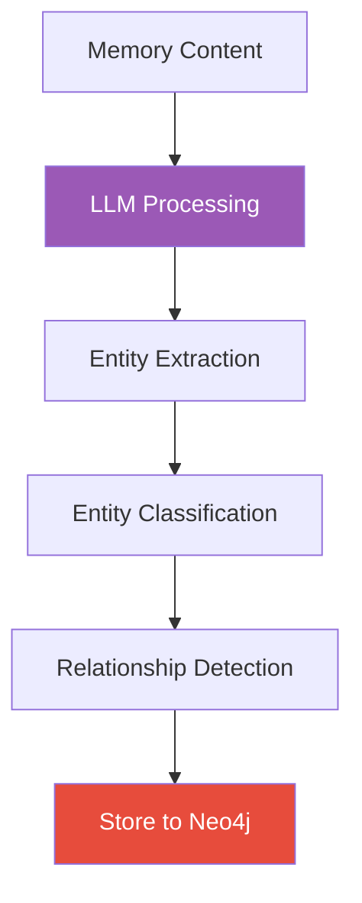

### Entity Extraction Process
1. **Parse** memory content
2. **Identify** entities using LLM
3. **Classify** into predefined types
4. **Detect** relationships between entities
5. **Store** entities and relationships to Neo4j

## 3. HybridRetrieve

**Purpose**: Implements RRF-based fusion of graph and memory results.

### Reciprocal Rank Fusion (RRF) Formula

$$
RRF(d) = \sum_{r \in R} \frac{1}{k + rank_r(d)}
$$

Where:
- `d` = document
- `R` = set of rankers (graph + memory)
- `k` = constant (default: 60)
- `rank_r(d)` = position of document in ranker r

### Default Weights
| Source | Weight |
|--------|--------|
| GraphRAG | 0.6 |
| Agent Zero Vector Memory | 0.4 |
| k constant | 60 |

## 4. GraphRAGExtensionHook

**Purpose**: Lifecycle hook that triggers GraphBuilder after each memory save.

```python
# Location: /a0/python/extensions/memory_saved_after/_80_graphrag_sync.py
# Triggered: After every memory_save operation
# Action: Syncs new memory to Neo4j graph
```

---

# SPEP Protocol

The **Seed → Pin → Expand → Pack** sequence for high-signal retrieval.

## SPEP Flow Diagram

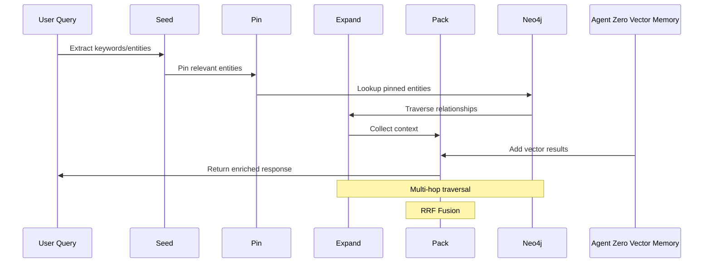

## Detailed Steps

### 1. SEED - Initial Query Processing
```
Input: "How does Project X relate to System Y?"
Output: Seeds = ["Project X", "System Y", "relate", "connection"]
```

### 2. PIN - Entity Identification
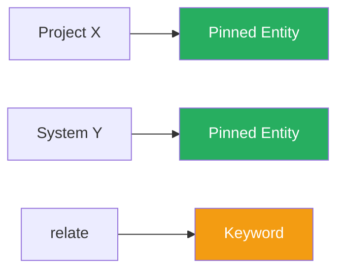

### 3. EXPAND - Graph Traversal
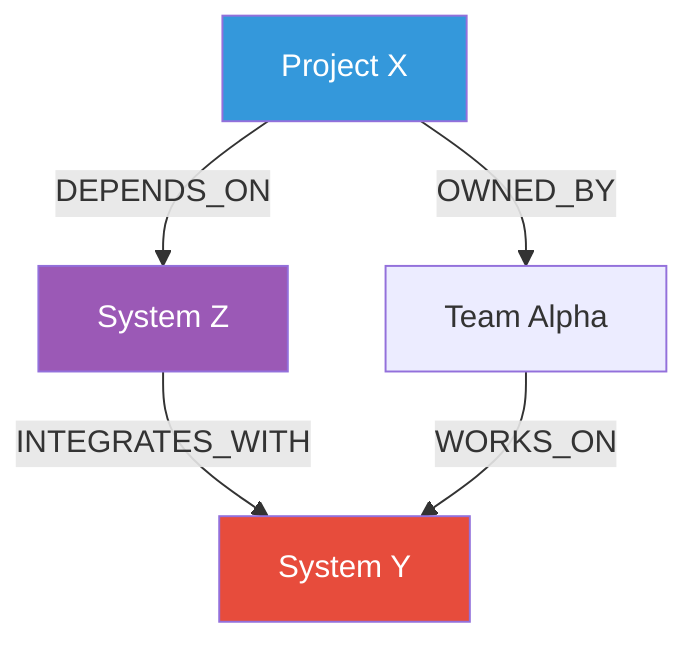

### 4. PACK - Context Assembly
```json
{
  "graph_context": {
    "entities": ["Project X", "System Y", "System Z"],
    "relationships": [
      "Project X DEPENDS_ON System Z",
      "System Z INTEGRATES_WITH System Y"
    ],
    "evidence": ["doc_123", "doc_456"]
  },
  "vector_context": {
    "documents": ["doc_789", "doc_012"],
    "scores": [0.85, 0.72],
    "source": "Agent Zero Vector Memory"
  }
}
```

---

# Advanced Brain Protocols (2026)

To elevate retrieval into autonomous reasoning, the Utility Model adheres to three cognitive protocols:

## 1. Conflict Handling
Discrepancies between Vector context and Graph topology MUST be resolved by prioritizing evidence found in `[DOC-ID]` citations. The agent identifies uncertainty and requests clarification if grounding is ambiguous.

## 2. Output-Driven Entity Resolution
The system uses normalized, canonical naming in its context synthesis. By using consistent terms (e.g., "John Smith" instead of variations) in its reasoning results, it ensures that downstream indexing maintains graph coherence.

## 3. Cognitive Consolidation
Recurring facts across multiple memories are promoted to **"Canon"** status. The agent identifies stable patterns over time, merging redundant memories into cohesive summaries to reduce noise and improve recall quality.

---

# Hybrid Retrieval Process

## Complete Retrieval Pipeline

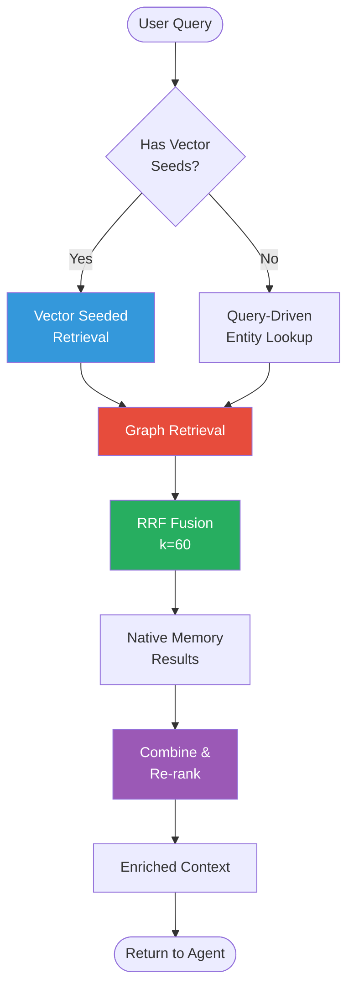

## Fusion Weights Visualization

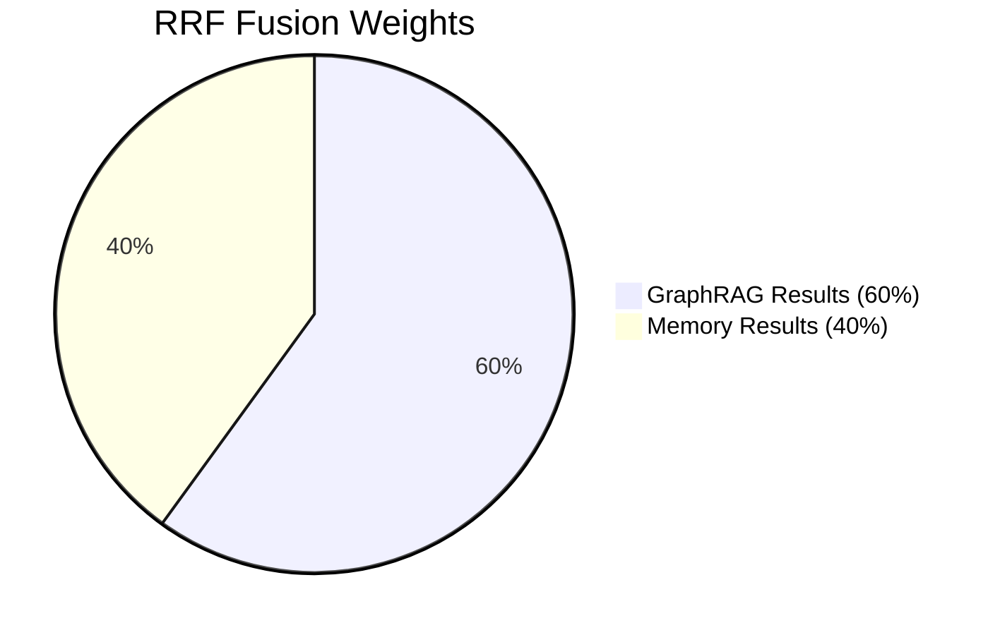

---

# Entity Types & Relationships

## Supported Entity Types

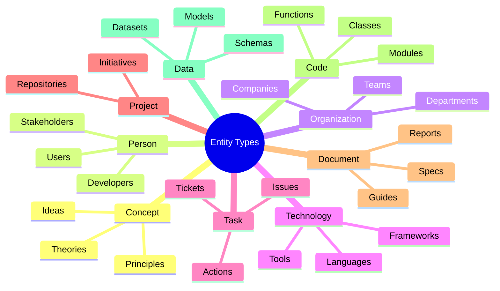

## Entity Relationship Types

| Relationship | Description | Example |
|-------------|-------------|---------|
| `DEPENDS_ON` | Dependency relation | Code → Code |
| `WORKS_ON` | Assignment relation | Person → Project |
| `OWNS` | Ownership relation | Team → Document |
| `REFERENCES` | Citation relation | Document → Code |
| `INTEGRATES_WITH` | Integration relation | System → System |
| `CREATED_BY` | Provenance relation | Document → Person |
| `CONTAINS` | Composition relation | Project → Task |

## Entity-Relationship Diagram Example

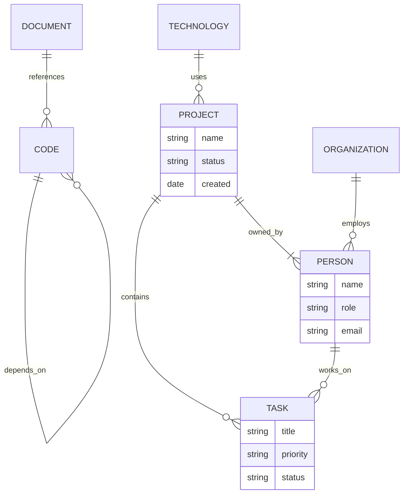

---

# Integration Points

## File Locations

```
/a0/ (Installed Path)
├── src/graphrag_agent_zero/
│   ├── extension_hook.py     ← Entrypoint
│   ├── hybrid_retrieve.py    ← Core SPEP logic
│   ├── graph_builder.py      ← NER & Ingestion
│   ├── neo4j_connector.py    ← Resilience Layer
│   └── safe_cypher.py        ← Security Layer
│
├── usr/extensions/           ← Persistence Layer
│   ├── agent_init/
│   │   └── _80_graphrag.py   ← Dynamic Patching
│   └── system_prompt/
│       └── _80_graphrag.md   ← Cognitive Inject
└── usr/memory/default/       ← Agent Zero Storage
```

> [!NOTE]
> **Persistence Mechanisms**:
> - **Dev Environment**: Uses named volumes (`graphrag_a0_usr`) for the `/a0/usr` directory.
> - **Bench/Production**: May use bind mounts (`./data:/a0/usr`) for direct host access.
> - **Neo4j**: Always persisted via named volumes (`neo4j-data`) to prevent graph data loss.

## Hook Integration (PR #1176)

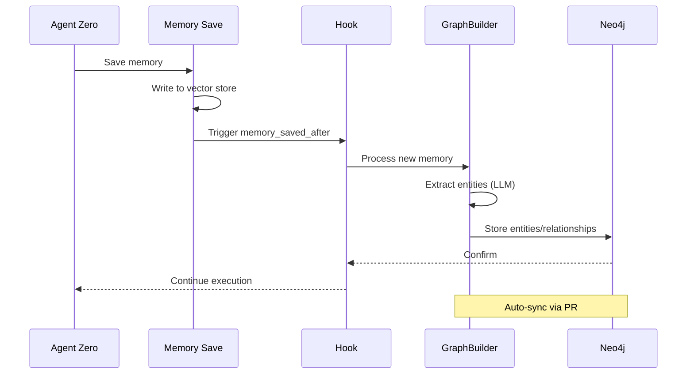

---

# Configuration Guide

## Basic Configuration

```json
{
  "graph": {
    "uri": "bolt://localhost:7687",
    "user": "neo4j",
    "password": "your_password_here"
  },
  "retrieval": {
    "graphrag_weight": 0.6,
    "memory_weight": 0.4,
    "rrf_k": 60
  },
  "hook": {
    "enabled": true,
    "name": "memory_saved_after"
  }
}
```

## Environment Variables

```bash
# Neo4j Connection
export NEO4J_URI="bolt://localhost:7687"
export NEO4J_USER="neo4j"
export NEO4J_PASSWORD="your_password"

# Optional Tuning
export GRAPHRAG_WEIGHT="0.6"
export MEMORY_WEIGHT="0.4"
export RRF_K="60"
```

## Graceful Fallback Behavior

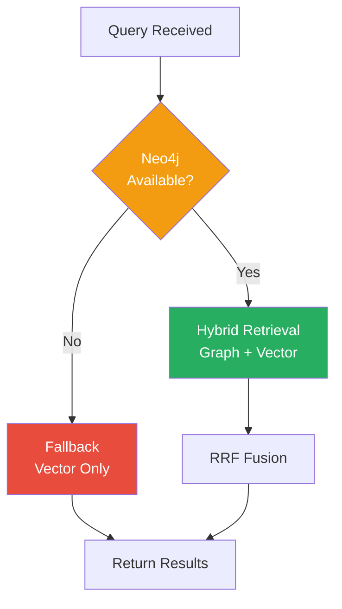

---

# Benefits & Use Cases

## How GraphRAG Makes Agent Zero "Smarter"

### 1. Multi-Hop Reasoning

```mermaid
graph LR
    A[Query: "Who approved Project X?"] --> B[Project X]
    B -->|OWNED_BY| C[Team Alpha]
    C -->|APPROVED_BY| D[John Smith]
    
    style A fill:#3498DB,color:#fff
    style D fill:#27AE60,color:#fff
```

**Traditional RAG**: Finds documents mentioning "Project X" and "approved"

**GraphRAG**: Traces Project X → Team → Approver relationship chain

### 2. Entity Grounding & Disambiguation

```mermaid
graph TD
    M1[Mercury] -->|IN_CONTEXT| A[Astronomy]
    M1 -->|ORBITS| S[Sun]
    
    M2[Mercury] -->|IN_CONTEXT| C[Chemistry]
    M2 -->|IS_ELEMENT| T[Transition Metal]
    
    Q["Tell me about Mercury"] --> CTX{Context?}
    CTX -->|Space| M1
    CTX|Chemistry| M2
    
    style M1 fill:#3498DB,color:#fff
    style M2 fill:#E74C3C,color:#fff
```

### 3. Structured Historical Context

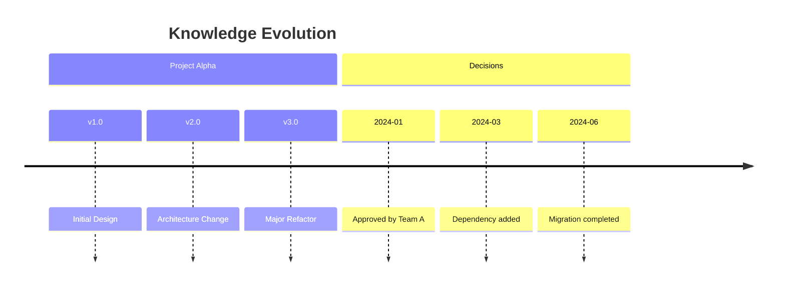

### 4. Direct Evidence & Provenance

| Feature | Traditional | GraphRAG |
|---------|-------------|----------|
| Citation | Document ID | Document + Relationship |
| Explanation | "Found in doc X" | "A → [WORKS_ON] → B (doc X, line 42)" |
| Trust | Similarity score | Explicit graph path |

## Business Value Matrix

| Use Case | Traditional RAG | Hybrid GraphRAG |
|----------|----------------|-----------------|
| **Software Engineering** | Code search | Dependency analysis, impact assessment |
| **Scientific Research** | Paper retrieval | Connection discovery, citation networks |
| **Legal & Compliance** | Clause search | Relationship mapping, obligation tracking |
| **Strategic Planning** | Document search | Resource & constraint tracking |

---

# Comparison with Default Memory

## Feature Comparison Table

| Aspect | Agent Zero Vector Memory | Hybrid GraphRAG |
|--------|---------------|-----------------|
| **Retrieval Strategy** | Pure vector similarity | Hybrid SPEP (graph + vector) |
| **Reasoning Depth** | Single-hop similarity | Multi-hop graph reasoning |
| **Entity Grounding** | None | Explicit Neo4j entity types |
| **Fault Tolerance** | Relies on vector store | Graceful fallback to vector store |
| **Sync Overhead** | Minimal | Auto-sync hook adds slight overhead |
| **Context Quality** | Similarity-based | Relationship-enriched |
| **Hallucination Risk** | Higher | Reduced (entity anchoring) |
| **Explainability** | Low | High (provenance paths) |

## Performance Characteristics

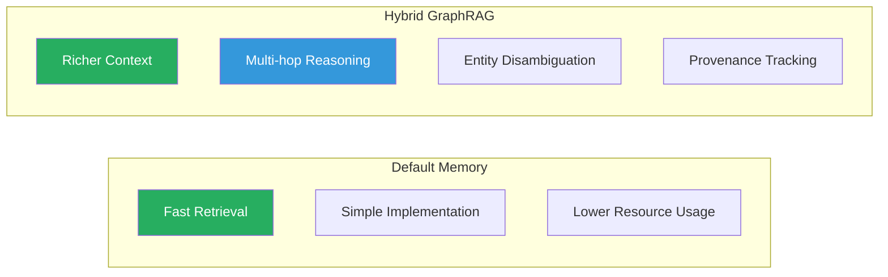

---

# Safe Cypher Engine

## Security Model

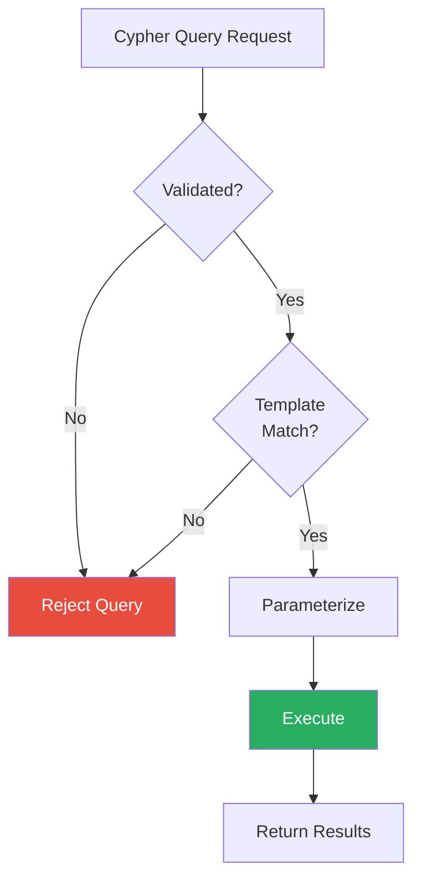

## Allowed Operations

| Operation | Status | Example |
|-----------|--------|---------|
| Node creation | ✅ Allowed | `CREATE (n:Entity $props)` |
| Relationship creation | ✅ Allowed | `CREATE (a)-[r:RELATES]->(b)` |
| Node lookup | ✅ Allowed | `MATCH (n:Entity) WHERE ...` |
| Arbitrary DELETE | ❌ Forbidden | - |
| Arbitrary code execution | ❌ Forbidden | - |
| Unvalidated parameters | ❌ Forbidden | - |

---

# Quick Start Guide

## 1. Prerequisites

```bash
# Install Neo4j (Docker recommended)
docker run -d \
  --name neo4j \
  -p 7474:7474 -p 7687:7687 \
  -e NEO4J_AUTH=neo4j/password123 \
  neo4j:latest
```

## 2. Configure Environment

```bash
export NEO4J_URI="bolt://localhost:7687"
export NEO4J_USER="neo4j"
export NEO4J_PASSWORD="password123"
```

## 3. Verify Installation

```bash
# Check GraphRAG module exists
ls -la /a0/src/graphrag_agent_zero/

# Check extension hooks
ls -la /a0/python/extensions/memory_saved_after/
```

## 4. Test Query

```python
# The GraphRAG will automatically:
# 1. Hook into memory_save operations
# 2. Extract entities from saved memories
# 3. Store entities/relationships to Neo4j
# 4. Enhance retrieval with graph context
```

---

# Troubleshooting

## Common Issues

| Issue | Cause | Solution |
|-------|-------|----------|
| Connection refused | Neo4j not running | Start Neo4j container |
| Auth failed | Wrong credentials | Check NEO4J_PASSWORD |
| Slow queries | Missing indexes | Create Neo4j indexes |
| Hook not firing | Extension disabled | Check hook enabled=true |

## Fallback Verification

```bash
# Test graceful fallback by stopping Neo4j
docker stop neo4j

# Agent Zero should continue working with vector-only retrieval
# No errors should appear in logs
```

---

# Version Information

- **Repository**: https://github.com/AijooseFactory/graphrag-agent-zero
- **Version**: v0.2.0 (2026 Release)
- **Author**: AijooseFactory
- **Protocols**: SPEP + Advanced Brain Protocols

---

*Document generated: 2026-03-02*
*Hybrid GraphRAG for Agent Zero - Technical Reference*
