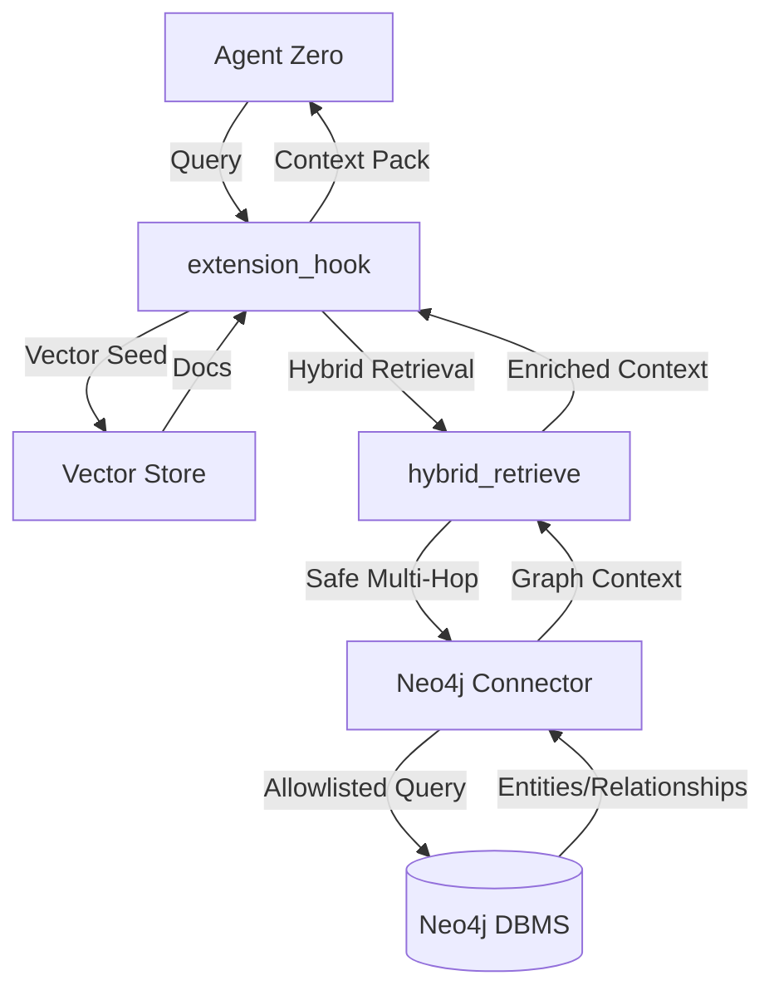

# Architecture

GraphRAG for Agent Zero is an extension that enhances the agent's retrieval capabilities with knowledge graph context.

## Component Overview

- **`extension_hook.py`**: The entrypoint for Agent Zero. It intercepts retrieval requests and orchestrates the hybrid retrieval process.
- **`hybrid_retrieve.py`**: The core logic for combining vector results with graph expansion. It performs "entity pinning" and "bounded traversal".
- **`neo4j_connector.py`**: A safe, bounded connection handler for Neo4j. It enforces timeouts and retries.
- **`safe_cypher.py`**: The security enforcement layer. All queries must match allowlisted templates.
- **`graph_builder.py`**: Utilities for indexing documents into the knowledge graph.

## Data Flow

## Safety Bounds
The system is designed with a "Failure as NO-OP" philosophy. If Neo4j is unreachable or a query fails, the system gracefully degrades to baseline vector retrieval, ensuring the agent loop never crashes.
